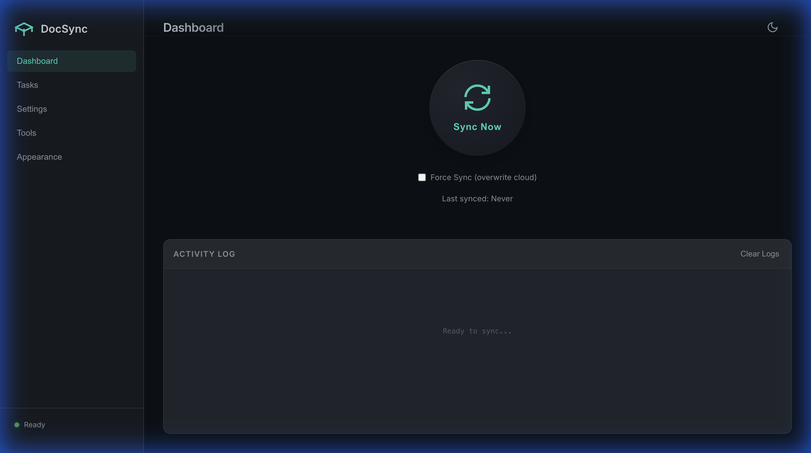

# 📚 DocSync - Obsidian to Feishu/Lark

<div align="center">

**将您的 Obsidian 知识库无缝同步到飞书云文档**

[](https://www.python.org/downloads/)
[](LICENSE)
[](#测试)

</div>

---

## ✨ 核心特性

- 🎯 **完美 Markdown 支持** - 标题、列表、代码块、引用、表格、图片
- 🖼️ **智能资源处理** - 自动上传图片，支持 `![[image.png]]` 语法
- ⚡ **高效同步** - 增量更新 + 并发处理
- 📂 **目录同步** - 递归同步整个文件夹
- 🔐 **安全存储** - Token 存储在系统钥匙串
- 💾 **智能备份** - 自动备份，版本还原
- 🖥️ **桌面应用** - Electron GUI 界面

---

## 🚀 快速开始

### 命令行方式

```bash
git clone https://github.com/zhangjian94cn/doc-sync.git
cd doc-sync
pip install -r requirements.txt

# 配置
python scripts/cli.py setup

# 同步
python main.py
```

### 桌面应用 (GUI)

```bash
cd electron-app
npm install
npm start
```



---

## 📋 命令速查

### 命令行

| 命令 | 说明 |
|------|------|
| `python scripts/cli.py setup` | 配置向导 |
| `python scripts/cli.py check` | 健康检查 |
| `python scripts/cli.py sync` | 执行同步 |
| `python scripts/cli.py restore <path>` | 还原备份 |
| `python scripts/cli.py clean` | 清理备份 |
| `python main.py --force` | 强制覆盖云端 |

### 桌面应用

| 功能 | 位置 |
|------|------|
| 同步 | Dashboard → Sync Now |
| 任务管理 | Tasks → 添加/编辑任务 |
| 凭据设置 | Settings → App ID/Secret |
| 健康检查 | Tools → Run Health Check |
| 备份清理 | Tools → Clean Backups |
| 主题切换 | Appearance / 右上角按钮 |

---

## 🔧 配置

### 飞书应用设置

1. 访问 [飞书开放平台](https://open.feishu.cn/app)
2. 创建**企业自建应用**
3. 配置权限：`docx:document`, `drive:drive`, `drive:file`
4. 回调地址：`http://127.0.0.1:8000/callback`
5. **创建版本并发布**

### 配置文件

```json
{
  "feishu_app_id": "cli_xxx",
  "feishu_app_secret": "xxx",
  "tasks": [{
    "note": "工作笔记",
    "local": "/path/to/folder",
    "cloud": "folder_token",
    "vault_root": "/path/to/vault"
  }]
}
```

---

## � 项目结构

```
doc-sync/
├── main.py              # 主入口
├── scripts/cli.py       # 命令行工具
├── src/                 # 核心模块
├── tests/               # Python 测试
├── electron-app/        # 桌面应用
│   ├── gui/             # 前端界面
│   └── tests/           # GUI 测试
└── docs/                # 文档
```

---

## 🧪 测试

```bash
# Python 单元测试
pytest tests/ -v

# Electron 单元测试
cd electron-app && npm test

# Electron E2E 测试
cd electron-app && npm run test:e2e
```

**测试覆盖**：29 个测试 (Python 4 + Jest 9 + Playwright 20)

---

## 📚 更多文档

- [使用指南](docs/USAGE_GUIDE.md) - 详细使用说明
- [更新日志](docs/CHANGELOG.md) - 版本记录

---

## ❓ 常见问题

| 问题 | 解决方案 |
|------|----------|
| `90003088` 错误 | 应用未发布，去控制台发布 |
| `1061004` 错误 | 无文件夹权限，换自己创建的 |
| 图片不显示 | 检查 `vault_root` 配置 |

---

## 🤝 贡献

欢迎 PR 和 Issue！

---

<div align="center">

**⭐ 如果这个项目对您有帮助，请给一个 Star！**

MIT License | Made with ❤️ by [zhangjian94cn](https://github.com/zhangjian94cn)

</div>
