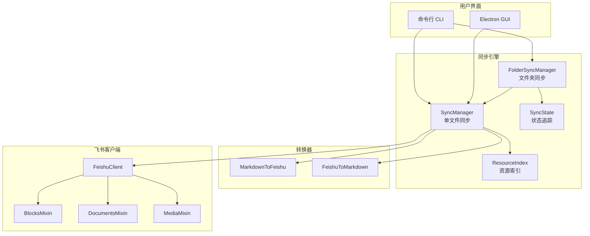

# 📚 DocSync - Obsidian to Feishu/Lark

<div align="center">

**将您的 Obsidian 知识库无缝同步到飞书云文档**

[](https://www.python.org/downloads/)
[](LICENSE)
[](#测试)

</div>

---

## ✨ 核心特性

- 🔄 **智能双向同步** - 自动检测本地/云端变更，按时间戳智能选择同步方向
- 🎯 **完美 Markdown 支持** - 标题、列表、代码块、引用、表格、图片
- 🖼️ **智能资源处理** - 自动上传图片，支持 `![[image.png]]` 语法
- ⚡ **高效增量同步** - 基于 hash 比对 + difflib 增量更新
- 📂 **目录同步** - 递归同步整个文件夹，支持并发处理
- 🔐 **安全存储** - Token 存储在系统钥匙串
- 💾 **智能备份** - 自动备份，版本还原
- 🖥️ **桌面应用** - Electron GUI 界面
- 🔒 **线程安全** - 并发同步时资源索引加锁保护

---

## 🚀 快速开始

### 命令行方式

```bash
git clone https://github.com/zhangjian94cn/doc-sync.git
cd doc-sync
pip install -r requirements.txt

# 配置
python scripts/cli.py setup

# 同步
python main.py
```

### 桌面应用 (GUI)

```bash
cd electron-app
npm install
npm start
```


---

## 📋 命令速查

### 命令行

| 命令 | 说明 |
|------|------|
| `python scripts/cli.py setup` | 配置向导 |
| `python scripts/cli.py check` | 健康检查 |
| `python scripts/cli.py sync` | 执行同步 |
| `python scripts/cli.py restore <path>` | 还原备份 |
| `python scripts/cli.py clean` | 清理备份 |
| `python main.py --force` | 强制覆盖云端（忽略云端更新） |
| `python main.py --overwrite` | 全量覆盖模式（清空云端后重新上传） |
| `python scripts/download_doc.py <doc_id>` | 下载飞书文档为 Markdown |
| `python scripts/compare_docs.py <local_file> <doc_token>` | 对比本地与云端文档 |
| `python scripts/compare_docs.py --config` | 批量对比配置中的所有任务 |

### 同步模式说明

| 模式 | 参数 | 说明 |
|------|------|------|
| **智能同步** | 无参数 | 根据修改时间自动判断同步方向 |
| **强制上传** | `--force` | 忽略云端更新，强制将本地内容上传 |
| **全量覆盖** | `--overwrite` | 清空云端文档后完全重写（适合格式错乱时使用） |

### 演示脚本

| 脚本 | 说明 |
|------|------|
| `python examples/api_demo.py` | API 功能演示 |
| `python examples/markdown_convert_demo.py` | Markdown 转换对比 |
| `python scripts/block_operations_demo.py` | 块 CRUD 操作演示 |

### 桌面应用

| 功能 | 位置 |
|------|------|
| 同步 | Dashboard → Sync Now |
| 强制同步 | Dashboard → ☑️ Force Sync |
| 任务管理 | Tasks → 添加/编辑任务 |
| 凭据设置 | Settings → App ID/Secret |
| 健康检查 | Tools → Run Health Check |
| 备份清理 | Tools → Clean Backups |
| 主题切换 | Appearance / 右上角按钮 |

---

## 🔧 配置

### 飞书应用设置

1. 访问 [飞书开放平台](https://open.feishu.cn/app)
2. 创建**企业自建应用**
3. 配置权限：`docx:document`, `drive:drive`, `drive:file`
4. 回调地址：`http://127.0.0.1:8000/callback`
5. **创建版本并发布**

### 配置文件

```json
{
  "feishu_app_id": "cli_xxx",
  "feishu_app_secret": "xxx",
  "feishu_assets_token": "xxx",
  "tasks": [{
    "note": "工作笔记",
    "local": "/path/to/folder",
    "cloud": "folder_token",
    "vault_root": "/path/to/vault",
    "enabled": true,
    "force": false
  }]
}
```

---

## 📁 项目结构

```
doc-sync/
├── main.py                 # 主入口
├── scripts/
│   ├── cli.py              # 命令行工具
│   ├── compare_docs.py     # 文档对比工具
│   └── download_doc.py     # 文档下载
├── src/
│   ├── sync/               # 同步模块
│   │   ├── manager.py      # 单文件同步 (SyncManager)
│   │   ├── folder.py       # 文件夹同步 (FolderSyncManager)
│   │   ├── state.py        # 同步状态追踪
│   │   └── resource.py     # 资源索引
│   ├── converter/          # Markdown ↔ Feishu 转换器
│   ├── feishu/             # 飞书 API 模块
│   │   ├── base.py         # 基础客户端（认证、限流）
│   │   ├── blocks.py       # 块操作
│   │   ├── documents.py    # 文档操作
│   │   └── media.py        # 媒体上传
│   ├── core/               # 核心功能
│   │   ├── auth.py         # OAuth 认证
│   │   └── restore.py      # 备份还原
│   └── feishu_client.py    # 统一客户端入口
├── tests/                  # Python 测试
├── electron-app/           # 桌面应用
│   ├── gui/                # 前端界面
│   └── tests/              # GUI 测试
└── docs/                   # 文档
```

---

## 🏗️ 架构



---

## 🧪 测试

```bash
# Python 单元测试
pytest tests/ -v

# Electron 单元测试
cd electron-app && npm test

# Electron E2E 测试
cd electron-app && npm run test:e2e
```

**测试覆盖**：114 个 Python 测试 + Jest 9 + Playwright 20

---

## 📚 更多文档

- [使用指南](docs/USAGE_GUIDE.md) - 详细使用说明
- [更新日志](docs/CHANGELOG.md) - 版本记录

---

## ❓ 常见问题

| 问题 | 解决方案 |
|------|----------|
| `90003088` 错误 | 应用未发布，去控制台发布 |
| `1061004` 错误 | 无文件夹权限，换自己创建的 |
| `99991677` Token 过期 | 程序会自动刷新，若失败请重新登录 |
| `20005` Token 失效 | 程序会尝试自动刷新或引导重新登录 |
| 图片不显示 | 检查 `vault_root` 配置 |
| 端口 8000 占用 | 关闭占用端口的程序或修改 `AUTH_SERVER_PORT` |
| 同步后内容不一致 | 使用 `scripts/compare_docs.py` 对比排查 |

---

## 🤝 贡献

欢迎 PR 和 Issue！

---

<div align="center">

**⭐ 如果这个项目对您有帮助，请给一个 Star！**

MIT License | Made with ❤️ by [zhangjian94cn](https://github.com/zhangjian94cn)

</div>
